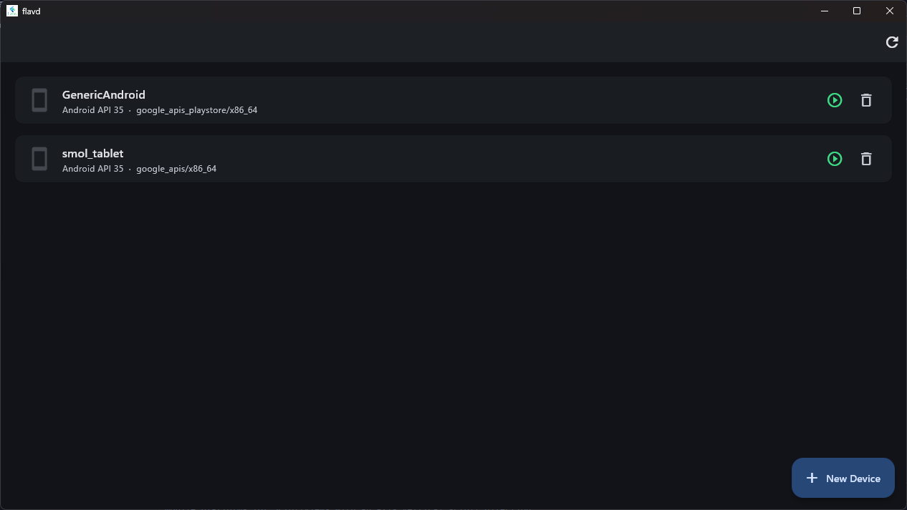
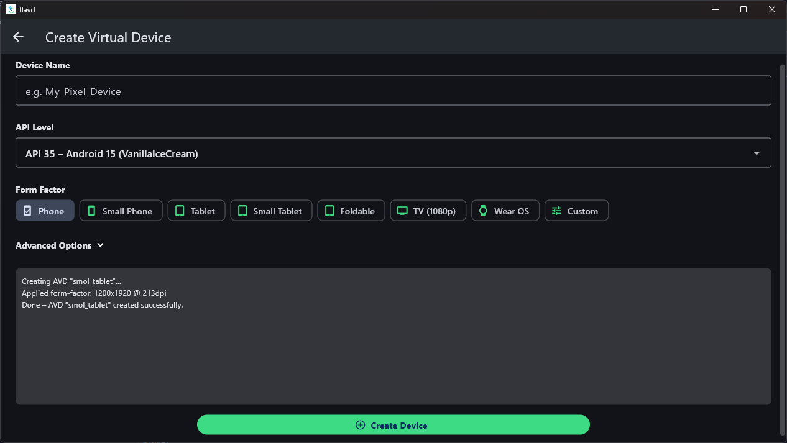

# flavd


**flavd** is a cross-platform desktop GUI built with [Flutter](https://flutter.dev/) that wraps the
[Android Virtual Device (AVD)](https://developer.android.com/studio/run/managing-avds) command-line
tools (`avdmanager` / `emulator`), giving you a clean interface for creating and managing Android
emulators without needing the full Android Studio IDE.

---

## Screenshots

| Home screen | Create device |
|---|---|
|  |  |

---

## Features

| Feature | Description |
|---|---|
| **Device list** | See all your existing AVDs at a glance. |
| **Physical devices** | View USB and wirelessly connected physical Android devices. |
| **Wireless ADB** | Pair and connect to a real phone over Wi-Fi (Android 11+ wireless debugging) — manually or via QR code. |
| **QR code pairing** | Generate a scannable QR code that your phone can read with "Pair device with QR code" for one-tap pairing. |
| **Start / Stop** | Launch an emulator or gracefully stop a running one. |
| **Delete** | Remove an AVD with a confirmation dialog. |
| **Create device** | Guided form to create a new AVD. |
| **Form-factor presets** | Phone, Small Phone, Tablet, Small Tablet, Foldable, TV, Wear OS, or fully custom width/height/density. |
| **API Level picker** | Choose from Android 8.0 (API 26) through Android 15 (API 35). |
| **Auto system-image install** | If the required system image is missing, flavd installs it for you via `sdkmanager`. |
| **Auto SDK setup** | If no Android SDK is detected, flavd downloads and installs the command-line tools into `~/.flavd/android-sdk`. |
| **Light & dark themes** | Follows the system theme preference (Material 3). |

---

## Requirements

| Dependency | Notes |
|---|---|
| Flutter ≥ 3.19 | Desktop support enabled |
| Dart ≥ 3.0 | Bundled with Flutter |
| `unzip` (Linux/macOS) | Used for extracting the SDK tools archive |

> **Java is NOT required.** `avdmanager` and `sdkmanager` in modern Android SDK command-line tools
> ship with their own JRE.

---

## Getting started

### 1 – Clone the repository

```bash
git clone https://github.com/PersonalClientCare/flavd.git
cd flavd
```

### 2 – Enable Flutter desktop support (once per machine)

```bash
flutter config --enable-linux-desktop   # Linux
flutter config --enable-macos-desktop   # macOS
flutter config --enable-windows-desktop # Windows
```

### 3 – Generate platform-specific files

Because the platform directories (`linux/`, `macos/`, `windows/`) are generated by Flutter tooling
and are not committed to the repository, you need to generate them once:

```bash
flutter create --platforms=linux,macos,windows .
```

### 4 – Get dependencies

```bash
flutter pub get
```

### 5 – Run

```bash
flutter run -d linux    # Linux
flutter run -d macos    # macOS
flutter run -d windows  # Windows
```

### 6 – Build a release binary

```bash
flutter build linux --release
# Binary: build/linux/x64/release/bundle/flavd
```

---

## Automatic SDK installation

When you open flavd on a machine that does not have the Android SDK installed, a banner is shown
with an **Install SDK** button.  Clicking it will:

1. Download the Android command-line tools ZIP from `dl.google.com` into the
   standard platform-specific SDK directory (see below).
2. Extract and move the tools to the expected `cmdline-tools/latest/` layout.
3. Accept all SDK licences automatically.
4. Install `platform-tools` and `emulator` via `sdkmanager`.

The SDK install location is resolved in this order:

1. `ANDROID_HOME` or `ANDROID_SDK_ROOT` environment variable (if set).
2. Platform default:
   - **Windows** – `%LOCALAPPDATA%\Android\Sdk` (if it exists) or `%USERPROFILE%\Android\android-sdk`
   - **macOS** – `~/Library/Android/sdk`
   - **Linux** – `~/Android/Sdk`

After installation, the rest of the app becomes available.

If you already have the Android SDK installed (e.g. via Android Studio), flavd detects it
automatically using the environment variables above, well-known platform paths, or by scanning
`PATH`.

---

## Creating a new virtual device

1. Click the **+ New Device** button.
2. Enter a **device name** (letters, digits, underscores, hyphens and dots only).
3. Select an **API level**.
4. Pick a **form factor** preset:
   - **Phone** – 1080 × 2400, 420 dpi
   - **Small Phone** – 720 × 1280, 320 dpi
   - **Tablet** – 1600 × 2560, 240 dpi
   - **Small Tablet** – 1200 × 1920, 213 dpi
   - **Foldable** – 1768 × 2208, 420 dpi
   - **TV (1080p)** – 1920 × 1080, 213 dpi
   - **Wear OS** – 384 × 384, 320 dpi
   - **Custom** – enter width, height and density manually
5. Optionally expand **Advanced Options** to change the ABI and system image tag.
6. Click **Create Device**.

If the required system image is not installed, flavd downloads and installs it automatically before
creating the AVD.

---

## Connecting a real phone via Wireless ADB

flavd supports connecting physical Android devices over Wi-Fi using Android 11+
wireless debugging. Click the **Wi-Fi icon** (📡) in the app bar to open the
Wireless ADB screen.

### Android 11+ — Manual pairing

1. On your phone, go to **Settings → Developer options → Wireless debugging** and
   enable it.
2. Tap **Pair device with pairing code** — note the IP address, pairing port, and
   6-digit code.
3. In flavd, open the Wireless ADB screen, keep the **Manual** tab selected in
   Step 1, fill in the values, and click **Pair**.
4. After pairing succeeds, enter the IP address and the **connect port** shown on the
   Wireless debugging screen (this is different from the pairing port) into Step 2
   (Connect) and click **Connect**.
5. The device appears in the home screen under **Physical Devices**.

> Pairing only needs to be done once per computer. After that you can reconnect
> using just Step 2 whenever the phone is on the same Wi-Fi network.

### Android 11+ — QR code pairing

1. On your phone, go to **Settings → Developer options → Wireless debugging**.
2. In flavd, open the Wireless ADB screen and switch to the **QR Code** tab in
   Step 1.
3. Enter the pairing code (password) shown on the phone and optionally a service
   name, then click **Generate QR Code**.
4. On your phone, tap **Pair device with QR code** and point the camera at the QR
   code displayed in flavd.
5. Once the phone confirms pairing, fill in the IP address, pairing port, and
   pairing code in the "After the phone confirms pairing" section and click
   **Complete Pairing** to register the device with ADB.
6. Proceed to Step 2 (Connect) as usual.

### Legacy method (Android 10 and below)

1. Connect the phone via USB and ensure ADB debugging is authorised.
2. Run `adb tcpip 5555` in a terminal.
3. Disconnect the USB cable.
4. In flavd, skip Step 1 and go straight to Step 2 — enter the phone's IP address
   with port **5555** and click **Connect**.

### Disconnecting

Wirelessly connected devices show a **disconnect** button (🔗✕) on their card in the
home screen. USB-connected devices are shown but cannot be disconnected from the GUI
(just unplug the cable).

---

## Project structure

```
lib/
├── main.dart                      Entry point
├── app.dart                       MaterialApp + provider wiring
├── models/
│   ├── adb_device.dart            Data class for a physical ADB device
│   ├── avd_device.dart            Data class for an AVD
│   ├── form_factor.dart           Form-factor presets
│   └── api_level.dart             Supported API levels
├── services/
│   ├── avd_service.dart           Wraps avdmanager / emulator / adb
│   └── sdk_installer_service.dart Downloads & installs the Android SDK
├── providers/
│   └── device_provider.dart       ChangeNotifier state management
├── screens/
│   ├── home_screen.dart           Main screen (device list)
│   ├── create_device_screen.dart  Create-device form
│   └── wireless_adb_screen.dart   Wireless ADB pair & connect screen (manual + QR)
└── widgets/
    ├── adb_device_card.dart        Physical device card
    ├── device_card.dart            Virtual device (AVD) card
    ├── log_output_widget.dart      Streaming process log view
    └── qr_painter_widget.dart      QR code renderer using the `qr` package

test/
└── flavd_test.dart                Unit tests for models and service parsing
```

---

## Tested on

| Platform | Status |
|---|---|
| Windows | ✅ Verified |
| Linux | ⬜ Untested |
| macOS | ✅ Untested |

---

## AI-generated project

This project was mostly generated with the help of AI (Claude). Contributions
and improvements are welcome — just keep in mind that the original codebase was
not hand-written.

---

## Running tests

```bash
flutter test
```

---

## Contributing

Pull requests are welcome.  Please run `flutter analyze` and `flutter test` before opening a PR.

---

## License

MIT – see [LICENSE](LICENSE) for details.
